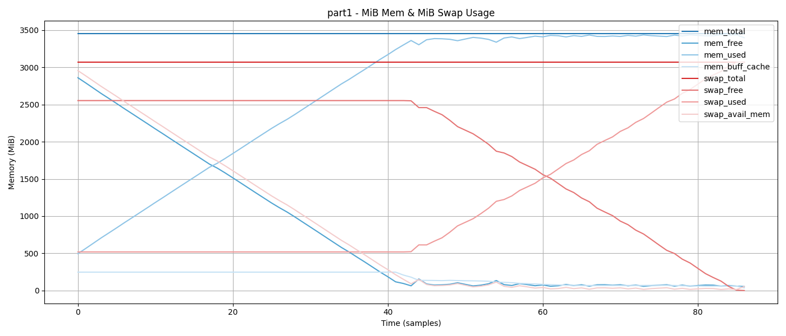

#### Параметры операционной системы до экспериментов

- **total_mem: 3.4 GiB**
  Общее количество физической оперативной памяти, установленной в системе.
- **total_swap: 3.0 GiB**
  Общий объем дискового пространства, выделенный под swap. Используется, когда физическая память
  (RAM) исчерпывается.
  
## Часть 1

### Анализ сообщения dmesg (OOM лог)

`[ 1815.502219] Out of memory: Killed process 4025 (bash) total-vm:6032912kB, 
anon-rss:3232044kB, file-rss:0kB, shmem-rss:0kB, UID:1000 pgtables:11404kB 
oom_score_adj:200`

- **total-vm: 6032912 kB**
    - Размер виртуальной памяти, выделенной процессу (~6 ГБ). Отражает общий объем
      адресного пространства, запрошенного процессом.
- **anon-rss: 3232044 kB**
    - Фактический объем физической памяти (~3.2 ГБ), занимаемый
      данными процесса (массивом).
- **oom_score_adj: 200**
    - Параметр, повышающий вероятность выбора данного процесса для завершения при
      нехватке памяти.

### Анализ графиков и динамики использования памяти

**График использования памяти и swap**


- **MiB Mem:**
    - **Показатели:**
        - **Total:** Фактический объем физической памяти, соответствующий 3.4 GiB - статичен
        - **Free:** обратно пропорциональная **Used**
        - **Buff/cache:** Небольшой объем памяти задействован под буферы и кэш

- **MiB Swap:**
    - **Показатели:**
        - **Total:** Общий объем swap равен 3.0 GiB - статичен
        - **Free:** обратно пропорциональна **Used**, видно, что использование кэша начинает расти одновременно с
          исчерпыванием физической памяти

[//]: # (**Показатели памяти процесса 4025 &#40;bash&#41;**)

[//]: # (![]&#40;plots/part1_memo.png&#41;)

[//]: # ()
[//]: # (- Показатели процесса в момент аварии)

[//]: # (    - **VIRT:** ~6031856 kB &#40;примерно 6 ГБ&#41; – общий объем виртуальной памяти, запрошенной процессом.)

[//]: # (    - **RES:** ~3.1 ГБ – фактическое использование физической памяти.)

[//]: # (    - **SHR** = 0 все время &#40;посколько процесс не делит память с другими процессами&#41;)

[//]: # ()
[//]: # (**Показатели CPU%, MEM%, PR, NI**)

[//]: # ()
[//]: # (![]&#40;plots/part1_pr_ni_common.png&#41;)

[//]: # ()
[//]: # (- Все время CPU загружена на 90-100%)

[//]: # (- Использование памяти растет линейно до ~90% и остается на таком уровне)

---

### Итоги

1. **Динамика использования памяти:**
    - При увеличении размера массива виртуальное адресное пространство процесса постепенно растет, сначала используя
      свободную RAM, а затем активно расходуя swap.

2. **Критический порог и аварийное завершение:**
    - При достижении 74,200,000 элементов общий объем виртуальной памяти вырос до ~6 ГБ, что привело к полному
      исчерпанию RAM (3397.8 из 3451.4 MiB) и swap (3072.0 из 3072.0 MiB).

---

## Часть 2

```
[ 228.129298] oom-kill:constraint=CONSTRAINT_NONE,nodemask=(null),cpuset=/,mems_allowed=0,global_oom,task_memcg=/user.slice/user-1000.slice/user@1000.service/app.slice/run-p3037-i3337.scope,task=bash,pid=3203,uid=1000  
[ 228.129315] Out of memory: Killed process 3203 (bash) total-vm:5862144kB, anon-rss:3332224kB, file-rss:0kB, shmem-rss:0kB, UID:1000 pgtables:10800kB oom_score_adj:200

[ 228.129266] oom-kill:constraint=CONSTRAINT_NONE,nodemask=(null),cpuset=/,mems_allowed=0,global_oom,task_memcg=/user.slice/user-1000.slice/user@1000.service/app.slice/run-p3037-i3337.scope,task=bash,pid=3205,uid=1000 
[ 228.129302] Out of memory: Killed process 3205 (bash) total-vm:5957144kB, anon-rss:3172776kB, file-rss:0kB, shmem-rss:0kB, UID:1000 pgtables:11260kB oom_score_adj:200
```

#### Графики памяти и CPU

**График "CPU% и MEM% по PID"**


**График "VIRT / RES / SHR" — Memory usage по PID**


На графике изображено потребление памяти (VIRT, RES, SHR) двумя процессами bash с PID 3203 и 3205.

С самого начала оба процесса равномерно растут по всем метрикам: виртуальная память (VIRT) растет 
с 0 до примерно 2.7 млн KB за 8 шагов, что соответствует 40 секундам. То же касается физической памяти 
(RES), которая у обоих достигает ~1.3 млн KB к этому времени. Метрика SHR (shared memory) у обоих 
процессов практически равна нулю на всём протяжении, что говорит об отсутствии разделяемых сегментов памяти.

После 40-й секунды (то есть на 9-м замере) процесс с PID 3203 исчезает — все линии, соответствующие ему, 
пропадают. Это может означать, что он был завершён, скорее всего из-за нехватки ресурсов (например, по 
инициативе системы или из-за внутреннего завершения по ошибке).

Сразу после этого процесс 3205 начинает активно потреблять память. Его VIRT растёт почти до 6 млн KB, 
а RES — до 3.1 млн KB. Это чётко указывает на то, что после завершения 3203, процесс 3205 получил 
возможность захватить все ранее разделяемые ресурсы. Это поведение характерно для конкурентного окружения, 
где процессы борются за ограниченные ресурсы: пока оба активны — ресурсы делятся, как только один 
завершается — другой получает доступ ко всей оставшейся памяти.

Таким образом, график иллюстрирует сценарий гонки за память: при равных условиях процессы потребляют 
ресурсы синхронно, но как только ресурсы заканчиваются, система завершает один процесс, позволяя другому 
продолжить работу, уже без ограничений.


[//]: # (**График "PR / NI" — Priorities**)

[//]: # (![]&#40;plots/part2_pr_ni.png&#41;)

---

**Критический порог и аварийное завершение:**
Указанные размеры массивов при аварии:

- `73 300 000` элементов
- `37 100 000` элементов

Суммарно это сопоставимо по памяти с тем, сколько занимал процесс в конце работы в первой части эксперимента, 
где единственный процесс мог безопасно аллоцировать такой объём.

Следовательно, оба процесса в попытке выделить такой объём памяти одновременно приводят к превышению доступных 
ресурсов и краху одного из них (в данном случае — PID 3203). Освободившийся объём сразу же захватывается 
оставшимся процессом, что видно по резкому росту его памяти после точки аварийного завершения параллельного процесса.

